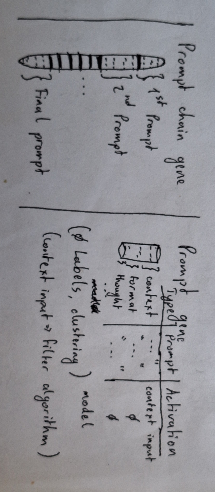
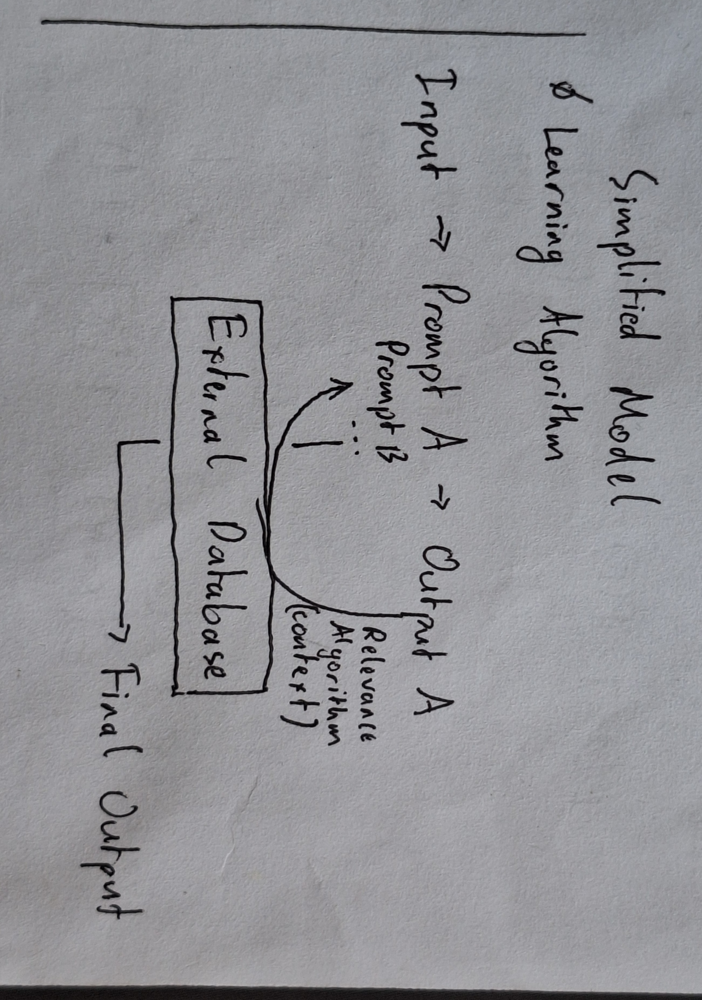

# Project Omnilection

> A genetic algorithm that evolves LLM prompt chains to find the best AI pipeline for a given task automatically — no manual prompt engineering needed.




---

## What It Does

Each "individual" in the population is a **prompt chain** — an ordered sequence of LLM calls where each step specifies a model and a prompt:

```python
[
  ("gpt-4",         "Summarise this: ", user_input),
  ("gpt-3.5-turbo", "Now extract the key points from: ")
]
```

The GA evolves a population of these chains over many generations. In each generation it selects the best performers, breeds new chains from them, mutates some for diversity, and replaces the weakest. Over time the population converges on the optimal pipeline.

---

## Setup

```bash
git clone https://github.com/killercookiee/Project-Omnilection.git
cd Project-Omnilection
pip install -r requirements.txt
python "Genetic_algorithm_processes/main_method.py"
```

> **Note:** The `.env` file is in `.gitignore` and will not be committed.

---

## Core Concepts: Fitness & Lineage

### 1. Fitness Calculation (Multiaxis)

Traditional exact-match scoring creates a binary "step-function" landscape where the genetic algorithm is blind to partial progress. Project Omnilection solves this using a **Base + Efficiency Bonus** architecture, evaluated dynamically.

**Accuracy**
An impartial local model grades the chain's output on a `0.0`–`1.0` scale based on a multi-axis rubric (e.g., Logic, Syntax, Architecture).

**Efficiency Scores**
Chains are scored (`1.0` = perfect) on three operational metrics:

| Metric | Description |
|---|---|
| **Time Score** | Exponential decay penalty applied if execution exceeds the optimal time limit. |
| **Token Score** | Linear penalty based on prompt and evaluation token consumption. |
| **Length Score** | Penalty for unnecessarily long multi-step architectures. |

**Final Formula**

To ensure fast-but-wrong chains do not outscore slow-but-accurate chains, the efficiency bonus is multiplied by accuracy itself:

```python
efficiency_sum = (
    (time_score   * self.weights["time_weight"]) +
    (length_score * self.weights["length_weight"]) +
    (token_score  * self.weights["token_weight"])
)
total_efficiency_weight = (
    self.weights["time_weight"] +
    self.weights["length_weight"] +
    self.weights["token_weight"]
)
normalized_efficiency = efficiency_sum / total_efficiency_weight

# Final Formula: Weighted accuracy + accuracy-scaled efficiency bonus
base_score       = accuracy * self.weights["accuracy_weight"]
efficiency_bonus = (normalized_efficiency * accuracy) * (1.0 - self.weights["accuracy_weight"])
final_fitness    = base_score + efficiency_bonus
```

> **Default Weights:** Accuracy 60% · Time 15% · Tokens 15% · Length 10%

---

### 2. Dynamic Lineage Scoring

Relying solely on fitness leads to **"Echo Chambers"** — a phenomenon where one lucky chain breeds rapidly, overtakes the entire population, and permanently destroys genetic diversity. To combat this, the system uses **Lineage Scoring**.

Lineage is a mathematically rigorous measure of prefix duplication and family crowdedness. It calculates how densely populated a specific "ancestral branch" is compared to the rest of the gene pool.

#### Prefix Tree Architecture

A "family" is dynamically defined by its exact sequence of prompts. For example, if a base chain is `[A, B]`, its lineage family includes every chain in history that starts with that exact prefix (e.g., `[A, B]`, `[A, B, C]`, `[A, B, X, Y]`).

#### The Mathematical Framework

The system computes a normalized score `[0, 1]` for every chain using:

```
Lineage_raw = (μ − α·SE) + β·D·W
```

| Symbol | Meaning |
|---|---|
| **μ** | Weighted mean fitness of all chains sharing this prefix. |
| **SE** | Standard Error proxy (uncertainty / approximation error). |
| **D** | Destiny score (Information Gain extracted from the prefix). |
| **W** | Shapiro–Wilk statistic (proxy for statistical normality within the family). |

#### Self-Adjusting Hyperparameters

The coefficients **α** and **β** are dynamically adjusted on-the-fly based on the population's current variance, ensuring the scoring system adapts whether the population is highly diverse or dangerously inbred.

#### In Practice

| Score | Meaning |
|---|---|
| **High lineage** | The chain's family is crowded and highly exploited. |
| **Low lineage** | The chain is a unique "explorer." |

These scores dictate which recombination strategies are used and who survives the replacement phase.

---

## Data Ingestion & Initial Population

Before evolution begins, the system constructs a highly diverse foundational gene pool (Generation 0) and establishes the neural architectures it will use to execute the prompts.

### 1. The Gene Pool (Data Sources)

The raw genetic material consists of thousands of distinct prompt instructions. The `GenePoolManager` automatically scrapes and curates these from top open-source repositories:

- **Sources:** Curated GitHub and Hugging Face datasets (e.g., `awesome-chatgpt-prompts`, `linexjlin/GPTs`, `system-prompts-and-models`).
- **Processing:** Raw prompts are downloaded, sanitized, split into modular instructional sections, and compiled into a massive local `prompt_segments.yaml` database to serve as the global gene pool.

### 2. Initial Population Generation (Generation 0)

To prevent premature convergence, Generation 0 cannot be purely random. The `InitialPopulationGenerator` guarantees a vast, evenly distributed search space using **Sentence Embeddings & K-Means Clustering**:

1. **Semantic Clustering** — All segments in the gene pool are embedded (via `scikit-learn` and `sentence-transformers`) and grouped into topical clusters.

2. **Tier Diversity Enforcement** — Candidate prompt chains are procedurally generated and strictly filtered through three mathematical constraints:

   | Constraint | Description |
   |---|---|
   | **Intra-step Coherence** | Segments combined within a single LLM step must belong to the same semantic cluster to ensure a logical instruction. |
   | **Intra-chain Variance** | Sequential steps within a chain must draw from entirely different clusters to force multi-step reasoning. |
   | **Inter-individual Distance** | A newly generated chain is only added to the Generation 0 pool if its mean cosine-similarity remains below a strict threshold compared to every previously accepted individual. |

### 3. The Local Model Registry

The genetic prompt sequences are executed by a curated registry of highly quantized, specialized local LLMs running via **Ollama**. This varied parameter space allows the topology migration system to optimize for both heavy reasoning and ultra-fast extraction.

#### Heavy Reasoning & Architecture
- `gemma3:latest` (4.3B, Q4_K_M) — completion + vision
- `codellama:latest` (7B, Q4_0)
- `qwen2.5-coder:latest` (7.6B, Q4_K_M) — completion + tools + insert

#### Fast Coding & Logic
- `deepseek-coder:latest` (1B, Q4_0)
- `qwen3:0.6b` (751M, Q4_K_M) — completion + tools + thinking
- `qwen2.5-coder:0.5b` (494M, Q4_K_M) — completion + tools + insert
- `qwen2.5:0.5b` (494M, Q4_K_M) — completion + tools
- `qwen:0.5b` (620M, Q4_0)
- `qwen2:0.5b` (494M, Q4_0)

#### Lightning-Fast Extraction
- `gemma3:270m` (268M, Q8_0)
- `smollm2:360m` (361M, F16)
- `smollm:360m` (361M, Q4_0)
- `smollm2:135m` (134M, F16)
- `smollm:135m` (134M, Q4_0)

#### Vector Embeddings
- `all-minilm:l6-v2` (23M, F16) — embedding only

---

## S1: Selection

Once the fitness scores and lineage metrics are calculated, the system chooses which prompt chains get to breed through a two-step process designed to preserve genetic diversity while heavily favoring high performers.

### 1. Exponential Fitness Scaling

Raw fitness scores can sometimes clump together (e.g., several chains scoring between `0.60` and `0.65`). If fed directly into a selection algorithm, the evolutionary pressure is too weak.

Before selection, the `PromptChainSelection` module applies an **Exponential Scaling Factor** (default `scale=3.0`):

```
Scaled_Fitness = exp(3.0 × Raw_Fitness)
```

This drastically amplifies the mathematical distance between mediocre chains and elite chains, ensuring the elites dominate the breeding pool without entirely zeroing out the chances of a novel, low-fitness "explorer" chain.

### 2. Stochastic Universal Sampling (SUS)

1. SUS lines up all the scaled fitness scores on a single continuous line.
2. It calculates a fixed `pointer_distance` by dividing the total population fitness by the number of parents needed.
3. **Single RNG Roll:** It rolls a random number exactly once to determine the starting point, then places pointers at perfectly equal intervals across the entire line.

This mathematically guarantees that highly fit chains are selected exactly proportional to their fitness value, ensuring zero RNG "clumping." It perfectly preserves the statistical distribution of the gene pool while selecting the parents for the next generation.

---

## S2: Recombination

### 1. Lineage-Aware Pairing Modes

The algorithm calculates a dynamic **lineage threshold** (typically the 75th percentile of the current population's lineage scores). Chains above this threshold are **"Established"** (proven but genetically crowded); chains below are **"Explorers"** (unique and novel).

When generating an offspring, the system probabilistically selects one of three pairing modes:

| Mode | Chance | Description |
|---|---|---|
| **Exploitation** | 25% | Pairs a High-Lineage parent with another High-Lineage parent from the same or similar family. Acts as local refinement — polishing a highly successful architecture without making chaotic jumps. |
| **Infidelity / Exploration** | 45% | Pairs an Established High-Lineage parent with a Low-Lineage Explorer from an entirely different family. Injects wild, novel genetic material into a proven, stable architecture to break out of local minima. |
| **Mentorship** | 30% | Looks for **"Godfathers"** — Low-Lineage chains that miraculously scored in the top 10% of global fitness (`mentorship_fitness_pct = 0.90`). Pairs this prodigy with an Established chain to quickly propagate its highly successful, novel genetics into the mainstream pool. |

### 2. Single-Point Crossover

Once two parents are paired, their genetic material is physically merged using the `LineageCrossover` mechanism:

- To prevent chains from becoming bloated and mathematically unstable, the algorithm strictly uses **Single-Point Crossover**.
- A crossover point is randomly selected based on the length of **Parent 1**.
- The new offspring inherits:
  - The **foundational prefix** (initial prompt steps) of Parent 1
  - The **suffix** (subsequent reasoning/extraction steps) of Parent 2
- If Parent 2 is shorter than the crossover point, the offspring simply inherits Parent 1's full architecture — preventing index errors and ensuring every offspring is structurally valid.

---

## S3: Mutation — Dynamic Rates & Multi-Method Strategies

Mutation introduces vital new genetic material into the population. To balance stable convergence with necessary exploration, the `PromptChainMutation` module utilizes a dynamically adjusting mutation rate and a diverse arsenal of mutation operators.

### 1. Dynamic Mutation Rate

The system actively tracks the highest fitness score across generations. If the population's maximum fitness **stagnates** (fails to improve for a set `stagnation_threshold`), the algorithm triggers a **Mutation Spike** — temporarily increasing the probability of mutation to force the population out of local minima, before gradually cooling back down to the baseline rate.

### 2. The Four Mutation Operators

When a chain is flagged for mutation, the system randomly applies one of four specialized methods to a selected step in the chain:

| Operator | Description |
|---|---|
| **Semantic LLM Mutation** | Uses an auxiliary LLM to deeply rewrite and rephrase the prompt segment. Acts as a heavy semantic shift, discovering entirely new ways to instruct the execution model. |
| **Gene Pool Swap** *(O(1) Mutation)* | Leverages pre-computed K-Means clusters from Generation 0. Instantly swaps a prompt segment with a mathematically similar one from the offline `prompt_segments.yaml` database — injecting structurally safe genetic material without the overhead of an LLM generation. |
| **Synonym Mutation** *(Light-Touch)* | Uses the NLTK WordNet corpus to perform rapid syntactic variations, randomly replacing words with synonyms. Fine-tunes the phrasing of a highly successful chain without destroying its core logic. |
| **Delete Mutation** | Randomly strips an entire execution step from the prompt chain. Acts as brutal evolutionary pressure for brevity, forcing the architecture to achieve the same accuracy with fewer models and tokens. |

---

## S4: Migration — Topology-Based Exodus

In Project Omnilection, "Migration" does not refer to moving individuals between separate populations. Instead, it refers to migrating a prompt chain's **underlying execution architecture** — swapping out the LLM that processes a specific step (e.g., replacing `llama3:8b` with `qwen2.5-coder:0.5b`). Because fitness heavily penalizes slow execution and high token usage, the algorithm naturally pressures chains toward smaller models — but blind jumps often destroy accuracy.

### 1. Dynamic Triggers — The Exodus Event

The `PromptChainMigration` module constantly monitors the global health of the gene pool. It triggers a massive **Exodus Event** — drastically increasing both the chance of migration and the severity of the jump — under two conditions:

| Trigger | Description |
|---|---|
| **Stagnation** | The highest fitness score has not improved for a set number of generations. |
| **Global Crowdedness** | The average Lineage Score across the entire population exceeds a critical threshold (e.g., `0.6`). A highly inbred gene pool forces migration to break up the echo chamber. |

### 2. K-Means Model Topology

To ensure model swaps are structurally safe, the system uses a mathematically defined topology rather than random selection:

- The `ModelClustering` module extracts hardware features from the local Ollama registry (e.g., parameter count, context length).
- It applies standard scaling and uses **K-Means Clustering** to group similar LLMs together in a multi-dimensional feature space.

### 3. Temperature-Controlled Jumps

When a chain migrates, the `ModelBasedTopology` uses an **exponential temperature decay formula** to calculate the probability of moving to a new model based on its topological distance from the current model.

| Temperature | Behavior |
|---|---|
| **Low** | Safe, local jumps to immediate neighbors within the same K-Means cluster (e.g., moving from a 0.5B to a 1.5B model). |
| **High** *(Exodus)* | Triggered by stagnation or crowdedness — temperature spikes, allowing chains to probabilistically leap across clusters (e.g., abandoning an 8B reasoning model for a 135M extraction model) to discover radically new efficiency optimizations. |

---

## S5: Simulated Annealing — Elite Local Search

While the main genetic algorithm excels at finding the globally optimal architecture (macro-search), it can sometimes miss the absolute best phrasing by just a few words. To squeeze out the last drops of fitness, the absolute **Elite** chains undergo an intense local search using **Simulated Annealing**.

### 1. The Micro-Mutation Operator

Unlike the heavy structural mutations in Stage 3 — which can swap entire LLMs or delete steps — Simulated Annealing uses a highly specialized `MicroMutation` operator:

- Utilizes the **NLTK WordNet** corpus to perform ultra-light-touch syntactic variations.
- Slightly rephrases sentences or swaps adjectives for synonyms **without** altering the underlying logic or LLM topology.
- Safely "polishes" the prompt at the surface level, leaving the core architecture intact.

### 2. Thermodynamic Acceptance Criteria

The algorithm runs the elite chain through multiple iterations of micro-mutations, governed by a **cooling temperature**:

| Outcome | Behaviour |
|---|---|
| **Positive Delta** | If the micro-mutation increases fitness, the new phrasing is instantly accepted and permanently overwrites the elite's genetics. |
| **Negative Delta** *(Probabilistic Safety Valve)* | If fitness decreases, the mutation is not immediately rejected. Instead, an acceptance probability is calculated: `P = exp((new_fitness - current_fitness) / current_temperature)`. |

#### The Cooling Schedule

- At **early iterations** (high temperature), the system frequently accepts slightly worse mutations — preventing the elite from getting trapped in a local maximum.
- As iterations continue, temperature decays by a `cooling_rate` (e.g., `0.85`), and the algorithm locks in strictly to the absolute peak phrasing.

---

## S6: Replacement — Task Difficulty & Age Penalties

The replacement phase determines which chains survive into the next generation. It combines the current parent population with the newly evaluated offspring pool into one massive arena. Before sorting by fitness, the system applies three critical reality-checks.

### 1. Posthumous Task Difficulty Normalization

If the dataset contains a mix of easy coding questions and brutally hard math problems, chains that randomly received harder tasks are at an unfair disadvantage.

- The `PromptChainReplacement` module groups all evaluated chains by their exact `task_id`.
- It calculates the global average fitness and compares it to the average fitness for each specific task.
- It applies a **Posthumous Difficulty Multiplier**: chains that solved harder-than-average tasks have their fitness scaled up, ensuring a mathematically fair global comparison.

### 2. Exponential Age Penalty

To prevent **"immortal" chains** — chains that got lucky early and refuse to die — from dominating the gene pool indefinitely, the system applies an age penalty:

- Chains are given a **3-generation grace period**.
- Once a chain reaches age 4, its adjusted fitness is hit with an exponential decay factor:

$$e^{-0.4 \times (\text{age} - 3)}$$

- By Generation 6, the penalty is so severe that a chain must be extraordinarily fit to survive over a fresh offspring.

### 3. Lineage Quotas — Explorer Protection

If the system simply took the top chains by fitness, it would quickly wipe out promising but unpolished genetic branches.

- The `LineageReplacement` module enforces a strict `exploration_ratio` (default **30%**).
- It calculates the **75th percentile** of lineage scores — chains below this threshold are classified as **"Explorers"**, those above as **"Established"**.
- The **30% Explorer quota is filled first**, guaranteeing that novel, low-lineage chains always have a place in the next generation.
- The remaining **70%** of population slots are then filled by the absolute highest-fitness elites, regardless of lineage.

---

## Hyperparameter Reference

The evolutionary pressure of Project Omnilection can be radically altered by tuning the following hyperparameters across the pipeline components:

| Stage | Hyperparameter | Default | Description |
|---|---|---|---|
| **S1: Fitness** | `accuracy_weight` | `0.60` | Base weight of the final composite score strictly tied to correctness. |
| **S1: Fitness** | `time_weight` | `0.15` | Portion of the efficiency bonus tied to execution speed. |
| **S1: Fitness** | `token_weight` | `0.15` | Portion of the efficiency bonus tied to prompt and completion token counts. |
| **S1: Fitness** | `length_weight` | `0.10` | Portion of the efficiency bonus tied to having fewer steps in the chain. |
| **S2: Recomb.** | `exploitation_ratio` | `0.25` | Probability of pairing similar, high-lineage families. |
| **S2: Recomb.** | `infidelity_ratio` | `0.45` | Probability of cross-family exploration pairing. |
| **S2: Recomb.** | `mentorship_ratio` | `0.30` | Probability of pairing a new high-performer with an established family. |
| **S3: Mutation** | `base_mutation_chance` | `0.20` | Base probability an offspring will undergo structural mutation. |
| **S3: Mutation** | `stagnation_threshold` | `3` | Generations without fitness improvement before triggering a spike in dynamic rates. |
| **S4: Migration** | `base_migration_chance` | `0.20` | Base probability an offspring will switch to a neighboring LLM topology. |
| **S4: Migration** | `base_temperature` | `0.30` | Controls how adventurous the migration jump is in the K-Means cluster. |
| **S6: Replace** | `exploration_ratio` | `0.30` | Percentage of the final population reserved strictly for low-lineage unique chains. |
| **S6: Replace** | `maturity_threshold` | `3` | Age threshold before the exponential age penalty begins culling old chains. |